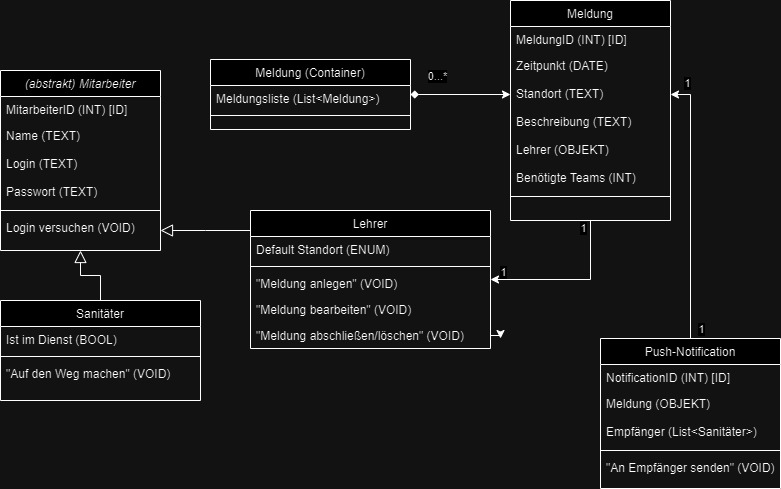

# Haspel-SSD
Mockup für eine Webapp zur Absprache zwischen Lehrern und Sanitätern am BK Haspel

# Anforderungen
Nutzer sollen sich mit vorgeneriertem User anmelden.  
Es sollen Meldungen von Lehrern erstellt werden.  
Meldungen sollen als Push Notification bei Sanitätern erscheinen.  
Sanitäter sollen sich zum Dienst melden können.  
Sanitäter sollen sich einer Meldung zuordenen können ("Wir sind unterwegs").  
Lehrer sollen Meldungen bearbeiten und abschließen können.  
Es sollen keine personenbezogenen Daten gespeichert/angezeigt werden.  
Gegen doppeltes Versenden und Unfug absichern.  
Es soll eine Admin-Page zum Verwalten von Accounts geben.  

# Elemente / Pages

### Login
Username eingeben  
Passwort eingeben  

### Dashboard (Übersicht aller Anfragen + Teams)
Button Lehrer: "Meldung erstellen"  
Zeitpunkt der letzten Aktualisierung wird unter der Liste angezeigt   
Liste aller Meldungen (rot = aktiv, gelb = keine Beschreibung, grün = unterwegs, grau = inaktiv)
<table style="width:100%">
  <tr>
    <th>Zeit</th>
    <th>Standort</th>
    <th>Beschreibung</th>
    <th>Name Ersteller</th>
    <th>Benötigte Teams</th>
    <th>Funktionsbuttons</th>
  </tr>
</table>
Funktionsbutton Sanitäter: "Wir sind unterwegs"  
Funktionsbutton Lehrer: "Meldung bearbeiten", "Meldung abschließen"  

### Meldung erstellen
<table style="width:100%">
  <tr>
    <th>Standort (Dropdown)</th>
    <th>Raumnummer (Dropdown)</th>
    <th>Teams benötigt (Dropdown)</th>
    <th>Alle Sanitäter rufen (Button)</th>
  </tr>
</table>

### User Control Pop-Up
Kleines Fenster oben rechts, öffnet sich durch Klicken  
Kleines "Profilbild" anzeigen  
Nutzernamen anzeigen  
Logout Button  
Slider Sanitäter: Status steuern (aktiv / inaktiv)  

### Push Notification an Sanitäter
Benachrichtigung "Sanitäter benötigt"  
-Standort anzeigen  

### Admin Dashboard
Liste aller Nutzer (Name + Rolle + Status)  
Neue Nutzer anlegen  
Nutzer verwalten (Änderungen von Name + Rolle)  
Passwort von Nutzer zurücksetzen  
Historie aller Meldungen + Statusänderungen  
Exportieren der Historie als PDF  

# Beschreibung

Im Login können sich Lehrer und Sanitäter mit einem vom Admin generierten Account anmelden. Nach erfolgreicher Anmeldung wird man auf das Dashboard weitergeleitet.
 
Das Dashboard sieht ja nach Account-Typ unterschiedlich aus. Es beinhaltet eine Liste der aktuellen Meldungen, den Zeitpunkt der letzten Aktualisierung, ein User Control Pop-Up und für Lehrer einen Button zum Erstellen neuer Meldungen.  
 
Eine Meldung in der Liste beinhaltet folgendes:  
-Zeit der Erstellung  
-Standort  
-Beschreibung  
-Name des Erstellers  
-Anzahl benötigter Teams  
-Button: "Wir sind unterwegs" (SANITÄTER)  
-Button: "Meldung bearbeiten" (LEHRER)  
-Button: "Meldung abschließen" (LEHRER)  
 
Eine erstellte Meldung wird vorerst als rot angezeigt.  
Wenn Sanitäter den Button "Wir sind unterwegs" klicken, ändert sich der Status der Meldung auf grün.  
Wenn Lehrer auf den Button "Meldung bearbeiten" klicken, können sie die Daten der Meldung abändern, diese werden in der Liste aktualisiert.  
Wenn Lehrer auf den Button "Meldung abschließen" klicken, wird die Meldung ausgegraut.  
 
Wenn Lehrer auf den Button "Meldung erstellen" klicken, öffnet sich eine Eingabemaske, in der die Meldung erstellt werden kann, folgende Dinge werden eingegeben: 
-Standort (Dropdown) 
-Raumnummer (Dropdown) 
-Anzahl benötigter Teams (Dropdown)  
 
Nach dem Erstellen wird die (unfertige) Meldung zwar schon abgeschickt aber auch farblich vorgehoben, bis der Lehrer eine Beschreibung eingegeben hat.  
 
Beim Erstellen einer neuen Meldung wird automatisch eine Push-Notification mit dem Standort an alle verfügbaren Sanitäter gesendet.  
 
Für Admins gibt es ein extra Dashboard zum Verwalten und Erstellen von User-Accounts.  

# Klassendiagramm

